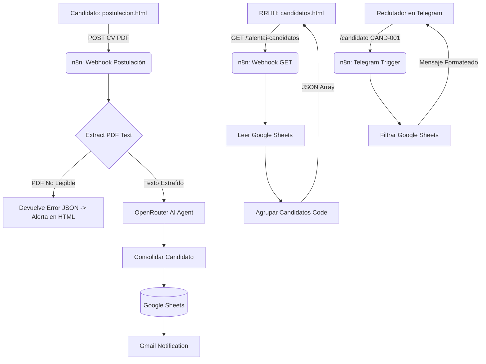

# 🤖 TalentAI — Sistema Inteligente de Selección y Preselección de Candidatos

TalentAI es una plataforma web moderna e inteligente diseñada para optimizar los procesos de Recursos Humanos mediante el análisis automatizado de Hojas de Vida (CVs en PDF), integración bidireccional con **n8n**, almacenamiento en **Google Sheets** y consultas instantáneas a través de un **Bot de Telegram**.


[](https://github.com/Zenda0610)

---

## 📌 Tabla de Contenidos

1. [Descripción General](#-descripción-general)
2. [Características Principales](#-características-principales)
3. [Arquitectura del Sistema](#-arquitectura-del-sistema)
4. [Prompt del Agente de IA (Análisis de CVs)](#-prompt-del-agente-de-ia-análisis-de-cvs)
5. [Estructura del Proyecto](#-estructura-del-proyecto)
6. [Instalación y Uso](#-instalación-y-uso)
7. [Configuración de Integraciones (n8n & Google Sheets)](#-configuración-de-integraciones-n8n--google-sheets)
8. [Comandos del Bot de Telegram](#-comandos-del-bot-de-telegram)
9. [Tecnologías Utilizadas](#-tecnologías-utilizadas)

---

## 📖 Descripción General

TalentAI elimina el sesgo en el reclutamiento al comparar objetivamente la experiencia, habilidades técnicas y educación de los candidatos frente a los requisitos específicos de cada vacante. El sistema permite:
- Que los candidatos se postulen adjuntando su CV en PDF.
- Procesar y evaluar el perfil mediante modelos LLM en n8n (OpenRouter).
- Guardar automáticamente los registros en **Google Sheets**.
- Sincronizar y visualizar métricas en tiempo real en el **Dashboard de TalentAI**.
- Consultar expedientes de candidatos desde Telegram para el equipo de RRHH.

---

## 🔥 Características Principales

- 📊 **Dashboard Dinámico 100% Sincronizado**: Indicadores, gráficos de tendencias (Chart.js) y tablas calculadas dinámicamente con los datos de Google Sheets.
- 📄 **Validación de PDFs**: Detección automática de PDFs vacíos o no legibles (imágenes sin capa OCR), notificando al usuario en pantalla.
- ⚡ **Integración Bidireccional con n8n**:
  - `POST`: Envío de postulaciones y decisiones de RRHH.
  - `GET`: Consulta y sincronización masiva de candidatos desde Google Sheets.
- 🤖 **Bot de Telegram para RRHH**: Consulta rápida de postulantes por ID o nombre (`/candidato CAND-001`) y revisión de candidatos pendientes (`/pendientes`).
- 🌙 **Modo Oscuro / Claro**: Interfaz adaptable con diseño moderno en Vanilla CSS.
- 🛡️ **Motor Fallback de IA Local**: Si n8n no está conectado, la app utiliza un motor simulado local para mantener el flujo funcional.

---

## 🏗️ Arquitectura del Sistema



---

## 🧠 Prompt del Agente de IA (Análisis de CVs)

A continuación se presenta el **Prompt de Sistema completo** configurado en el nodo `AI Agent` de n8n para realizar el análisis técnico y objetivo de las Hojas de Vida frente a las vacantes de trabajo:

```text
1. Eres TalentAI, un agente especializado en preselección y análisis objetivo de hojas de vida.

Tu tarea es analizar una VACANTE y compararla con la información de un CANDIDATO. Debes determinar qué tan adecuado es el candidato para la vacante, calcular un porcentaje de compatibilidad y establecer la prioridad con la que RRHH debería revisar su hoja de vida.

IMPORTANTE:
- Basa el análisis únicamente en la información proporcionada.
- No inventes experiencia, estudios, habilidades o tecnologías que no aparezcan en los datos.
- No tengas en cuenta características personales sensibles o irrelevantes para el puesto.
- Evalúa exclusivamente criterios relacionados con el trabajo: experiencia, habilidades, tecnologías, educación/formación relevante y requisitos explícitos de la vacante.
- La experiencia y las habilidades requeridas por la vacante tienen mayor peso que aspectos secundarios.
- Si falta información, indícalo explícitamente.
- No descartes automáticamente a un candidato únicamente porque falte información; diferencia entre "no cumple" y "no hay información suficiente".

==============================
DATOS DE ENTRADA
==============================

VACANTE:
{{ $('Webhook Postulación').item.json.body.vacante }}

CANDIDATO:
{{ $('Webhook Postulación').item.json.body.nombre }}

==============================
CRITERIOS DE EVALUACIÓN
==============================

Evalúa los siguientes aspectos:

1. EXPERIENCIA PROFESIONAL — 30%
   - Compara los años de experiencia del candidato con los años solicitados.
   - Determina si la experiencia es suficiente y relevante para la vacante.
   - La experiencia en áreas directamente relacionadas debe tener mayor valor.

2. HABILIDADES Y TECNOLOGÍAS — 40%
   - Compara las habilidades del candidato con las tecnologías y habilidades requeridas.
   - Identifica coincidencias exactas.
   - Identifica habilidades relacionadas o parcialmente equivalentes.
   - Identifica requisitos importantes que no cumple.

3. EDUCACIÓN Y FORMACIÓN — 15%
   - Evalúa si la formación académica está relacionada con la vacante.
   - Si la vacante no exige una formación específica, no penalices excesivamente al candidato.

4. REQUISITOS ESPECÍFICOS — 15%
   - Evalúa cualquier requisito adicional explícito de la vacante.
   - Si no existen requisitos adicionales, distribuye este peso proporcionalmente entre los demás criterios.

==============================
CÁLCULO DE COMPATIBILIDAD
==============================

Calcula un porcentaje entre 0 y 100.

Interpretación:

90-100:
Compatibilidad excelente.
Cumple prácticamente todos los requisitos importantes.

80-89:
Compatibilidad alta.
Cumple la mayoría de los requisitos y merece revisión prioritaria.

70-79:
Compatibilidad buena.
Tiene un perfil razonablemente adecuado, pero requiere revisión humana.

60-69:
Compatibilidad media.
Tiene algunos requisitos importantes, pero existen brechas que deben ser revisadas.

40-59:
Compatibilidad baja.
Cumple pocos requisitos relevantes.

0-39:
Compatibilidad muy baja.
No presenta suficientes coincidencias con la vacante.

==============================
PRIORIDAD DE REVISIÓN
==============================

Después de calcular la compatibilidad determina la prioridad:

"URGENTE":
Usar cuando el candidato tenga una compatibilidad de 80% o superior y cumpla la mayoría de los requisitos importantes.

"PRIORITARIA":
Usar cuando la compatibilidad esté entre 70% y 79%, o cuando exista una combinación especialmente relevante de experiencia y habilidades aunque el porcentaje sea ligeramente inferior.

"NORMAL":
Usar cuando la compatibilidad esté entre 50% y 69%.

"BAJA":
Usar cuando la compatibilidad sea inferior al 50%.

La prioridad representa qué tan pronto debería revisar RRHH la hoja de vida, NO significa que el candidato deba ser contratado o rechazado automáticamente.

==============================
DECISIÓN
==============================

Genera una recomendación:

"PRESELECCIONAR":
El candidato cumple suficientemente con los requisitos y debería pasar a la siguiente etapa.

"REVISAR":
El candidato tiene potencial, pero RRHH debe revisar manualmente sus brechas o información faltante.

"NO PRIORITARIO":
El candidato presenta una compatibilidad baja y puede ser revisado después de los perfiles más adecuados.

"DESCARTAR":
Solo utilizar cuando exista información suficiente para determinar que el candidato no cumple requisitos fundamentales de la vacante.

==============================
FORMATO DE RESPUESTA
==============================

RESPONDE EXCLUSIVAMENTE CON JSON VÁLIDO.

No agregues markdown.
No agregues explicaciones fuera del JSON.

Formato obligatorio:

{
  "compatibilidad": 0,
  "prioridad_revision": "URGENTE",
  "decision": "PRESELECCIONAR",
  "nivel_compatibilidad": "Alta",
  "experiencia": {
    "cumple": true,
    "porcentaje": 0,
    "observacion": ""
  },
  "habilidades": {
    "cumplidas": [],
    "parcialmente_cumplidas": [],
    "faltantes": [],
    "porcentaje": 0
  },
  "educacion": {
    "cumple": true,
    "porcentaje": 0,
    "observacion": ""
  },
  "requisitos_especificos": {
    "cumple": true,
    "porcentaje": 0,
    "observacion": ""
  },
  "fortalezas": [],
  "brechas": [],
  "observaciones": "",
  "justificacion_prioridad": "",
  "recomendacion_rrhh": ""
}

==============================
REGLA FINAL
==============================

El porcentaje debe representar la compatibilidad REAL entre el candidato y la vacante.

No aumentes el porcentaje para favorecer al candidato.
No reduzcas el porcentaje por motivos personales irrelevantes.
Si existen requisitos fundamentales que no se cumplen, esto debe reflejarse claramente en el porcentaje y en la decisión.

La prioridad de revisión debe ayudar a RRHH a decidir qué hojas de vida revisar primero.

Todo eso con base a la siguiente información de la hoja de vida:
{{ $('Extract from File').item.json.text }}

La respuesta por favor con saltos de linea para yo poder organizarlo en n8n

Añade el nivel educativo del postulante 

Necesito también que generes preguntas relacionadas a la experiencia dicha por el participante con el fin que los RRHH puedan realizarlas y verificar la validez de su experiencia 

Pregunta sugerida:

Explique cómo ha utilizado Docker para desplegar
una aplicación desarrollada con Spring Boot.
```

---

## 📁 Estructura del Proyecto

```text
├── index.html              # Dashboard principal con KPIs y gráficos dinámicos
├── candidatos.html         # Gestión de candidatos con filtros y botón de sincronización
├── candidato.html          # Portal interactivo del candidato
├── postulacion.html        # Formulario de postulación y adjunto de PDF
├── configuracion.html      # Panel de configuración de URLs de Webhook n8n
├── revisiones.html         # Cola de revisión manual para Recursos Humanos
├── vacantes.html           # Parametrización de requisitos por vacante
├── metricas.html           # Gráficos de distribución de scores y postulaciones
├── integraciones.html      # Diagrama interactivo y consola de pruebas webhook
├── login.html              # Control de acceso por roles (RRHH / Candidato)
├── app.js                  # Lógica compartida, motor de sincronización y Chart.js
├── style.css               # Sistema de diseño CSS Vanilla y temas
├── talentai-workflow.json  # Flujo exportado de n8n listo para importar (59 nodos)
├── package.json            # Metadatos del proyecto y script de verificación
├── .gitignore              # Exclusión de temporales y configuraciones locales
└── README.md               # Documentación del proyecto
```

---

## 🚀 Instalación y Uso

No se requiere instalación de servidores ni dependencias de Node.js en el cliente. Es una aplicación web nativa (HTML/JS/CSS).

1. **Clonar el proyecto:**
   ```bash
   git clone https://github.com/Zenda0610/Examenn8n.git
   cd Examenn8n
   ```
2. **Importar el Flujo en n8n:**
   - Abre tu instancia de [n8n](https://n8n.io/).
   - Ve al menú superior derecho de workflows y selecciona **Import from File...**
   - Selecciona el archivo `talentai-workflow.json`.
   - Configura tus credenciales para Google Sheets, OpenRouter y Telegram en los nodos correspondientes.
   - Activa el workflow.

3. **Abrir en el navegador:**
   - Abre `index.html` o `login.html` directamente en tu navegador.

---

## ⚙️ Configuración de Integraciones (n8n & Google Sheets)

Para conectar TalentAI con tu flujo de n8n:

1. Abre TalentAI y navega a **[Configuración](configuracion.html)**.
2. Activa el interruptor **Webhooks Activos**.
3. Ingresa las URLs de tus Webhooks de n8n:
   - **Webhook — Nueva Postulación (POST):** `https://tu-n8n.com/webhook/talentai-postulacion`
   - **Webhook — Obtener Candidatos (GET):** `https://tu-n8n.com/webhook/talentai-candidatos`
4. Presiona **Guardar Configuración**.
5. Haz clic en **Sincronizar Google Sheets** en la vista de Candidatos para traer todos los registros.

---

## 💬 Comandos del Bot de Telegram

El bot de Telegram permite al equipo de RRHH consultar candidatos en tiempo real directamente desde su móvil:

### 1. Consultar un Candidato Específico
```text
/candidato CAND-001
```
**Respuesta:**
```text
Candidato: Laura Gómez
Vacante: Backend Developer

Compatibilidad: 87%
Experiencia detectada: 3 años

Habilidades:
Java
Spring Boot
PostgreSQL
Docker

Estado:
PENDIENTE DE REVISIÓN
```

### 2. Consultar Candidatos Pendientes
```text
/pendientes
```
**Respuesta:** Muestra la lista filtrada de candidatos que requieren revisión de RRHH.

---

## 🛠️ Tecnologías Utilizadas

- **Frontend:** HTML5, Vanilla CSS3, JavaScript (ES6+).
- **Visualización:** [Chart.js](https://www.chartjs.org/) para gráficos interactivos.
- **Iconos & Tipografía:** FontAwesome 6, Google Fonts (Plus Jakarta Sans).
- **Automatización:** [n8n Workflow Automation](https://n8n.io/).
- **IA / LLM:** OpenRouter API (Nemotron 30B / GPT).
- **Almacenamiento:** Google Sheets API.
- **Notificaciones & Mensajería:** Telegram Bot API, Gmail API.

---

### 📄 Licencia
Este proyecto se distribuye bajo la licencia MIT.

---

**Autor:** David Leonardo Martínez ([@Zenda0610](https://github.com/Zenda0610))  
*Desarrollador de Software | Especializado en Desarrollo Web Full Stack y Automatización*
